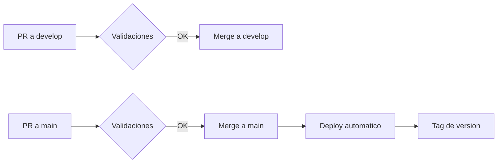

# Guia de Contribucion

Este documento describe el flujo de trabajo para contribuir al proyecto usando GitFlow.

## Estructura de Ramas

```
main          ─────●─────────●─────────●─────── produccion
                   │         ↑         ↑
                   │         │         │
develop       ─────●────●────●────●────●─────── integracion
                        │    ↑    │    ↑
                        │    │    │    │
feature/*               └────┘    │    │
                                  │    │
hotfix/*                          └────┘
```

### Ramas principales

| Rama | Proposito | Protegida |
|------|-----------|-----------|
| `main` | Codigo en produccion | Si |
| `develop` | Rama de integracion para desarrollo | Si |

### Ramas de soporte

| Tipo | Prefijo | Se crea de | Se mergea a |
|------|---------|------------|-------------|
| Feature | `feature/` | `develop` | `develop` |
| Release | `release/` | `develop` | `main` y `develop` |
| Hotfix | `hotfix/` | `main` | `main` y `develop` |

## Flujo de Trabajo

### 1. Desarrollar una nueva funcionalidad

```bash
# Asegurate de estar en develop actualizado
git checkout develop
git pull origin develop

# Crear rama de feature
git checkout -b feature/nombre-descriptivo

# Trabajar en los cambios...
git add .
git commit -m "feat: descripcion del cambio"

# Subir la rama
git push -u origin feature/nombre-descriptivo
```

Luego crear un **Pull Request hacia `develop`** en GitHub.

### 2. Preparar un release

Cuando `develop` tiene suficientes features para un release:

```bash
# Crear rama de release desde develop
git checkout develop
git pull origin develop
git checkout -b release/X.X.X

# Actualizar version en package.json
# Hacer commits de ajustes finales si es necesario

git push -u origin release/X.X.X
```

Crear **dos Pull Requests**:
1. `release/X.X.X` → `main` (para produccion)
2. `release/X.X.X` → `develop` (para sincronizar cambios)

### 3. Corregir un bug en produccion (hotfix)

```bash
# Crear rama de hotfix desde main
git checkout main
git pull origin main
git checkout -b hotfix/descripcion-del-bug

# Corregir el bug
# Actualizar version en package.json (patch version)

git add .
git commit -m "fix: descripcion de la correccion"
git push -u origin hotfix/descripcion-del-bug
```

Crear **dos Pull Requests**:
1. `hotfix/X.X.X` → `main` (para produccion)
2. `hotfix/X.X.X` → `develop` (para incluir el fix en desarrollo)

## Convenciones de Commits

Usamos [Conventional Commits](https://www.conventionalcommits.org/):

| Tipo | Descripcion |
|------|-------------|
| `feat` | Nueva funcionalidad |
| `fix` | Correccion de bug |
| `docs` | Cambios en documentacion |
| `style` | Cambios de formato (no afectan el codigo) |
| `refactor` | Refactorizacion de codigo |
| `test` | Agregar o modificar tests |
| `chore` | Tareas de mantenimiento |

**Ejemplos:**
```
feat: agregar endpoint de autenticacion
fix: corregir validacion de email
docs: actualizar instrucciones de instalacion
refactor: extraer logica de validacion a utils
```

## Versionado

Seguimos [Semantic Versioning](https://semver.org/):

```
MAJOR.MINOR.PATCH
  │     │     │
  │     │     └── Correcciones de bugs (hotfix)
  │     └──────── Nuevas funcionalidades (feature)
  └────────────── Cambios incompatibles (breaking changes)
```

**Ejemplos:**
- `1.0.0` → `1.0.1` : Bug fix
- `1.0.1` → `1.1.0` : Nueva feature
- `1.1.0` → `2.0.0` : Breaking change

## Checklist antes de crear un PR

- [ ] El codigo compila sin errores
- [ ] Los tests pasan localmente
- [ ] La version en `package.json` esta actualizada
- [ ] Los commits siguen las convenciones
- [ ] El PR tiene una descripcion clara

## Flujo de CI/CD



### Validaciones en PRs

| Check | Descripcion |
|-------|-------------|
| `check-version` | Verifica que la version sea nueva |
| `security-audit` | Escanea vulnerabilidades con npm audit |

## Resumen Visual

```
┌─────────────────────────────────────────────────────────────┐
│                      FLUJO GITFLOW                          │
├─────────────────────────────────────────────────────────────┤
│                                                             │
│  ┌──────────┐                                               │
│  │   main   │ ◄─── Solo releases y hotfixes                 │
│  └────┬─────┘      Deploy automatico a produccion           │
│       │                                                     │
│       │ merge                                               │
│       │                                                     │
│  ┌────┴─────┐                                               │
│  │ develop  │ ◄─── Integracion de features                  │
│  └────┬─────┘      Rama base para desarrollo                │
│       │                                                     │
│       │ branch                                              │
│       ▼                                                     │
│  ┌──────────┐                                               │
│  │ feature/ │ ◄─── Una rama por funcionalidad               │
│  └──────────┘      PR a develop cuando esta listo           │
│                                                             │
└─────────────────────────────────────────────────────────────┘
```
