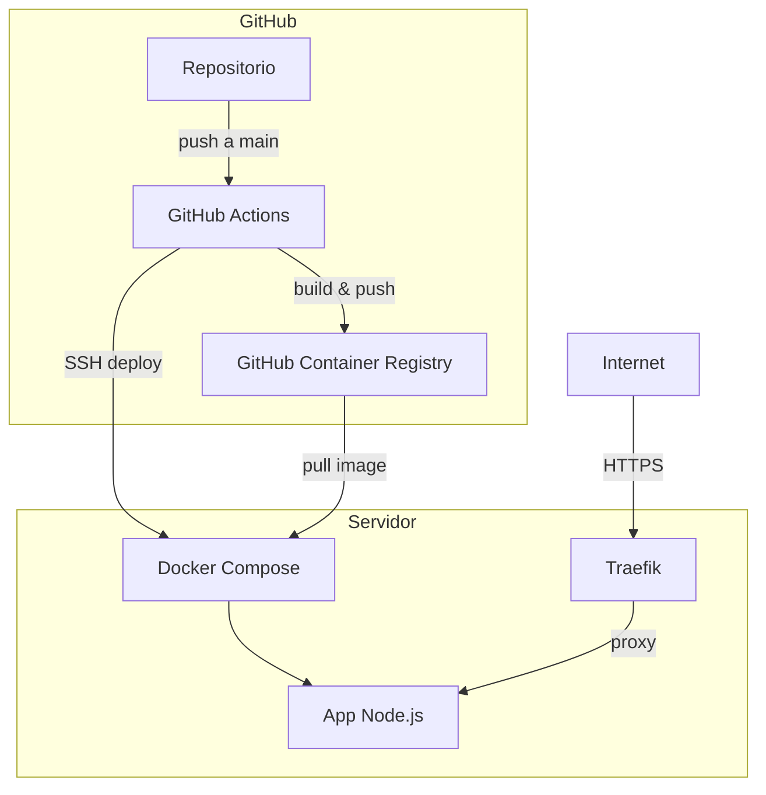
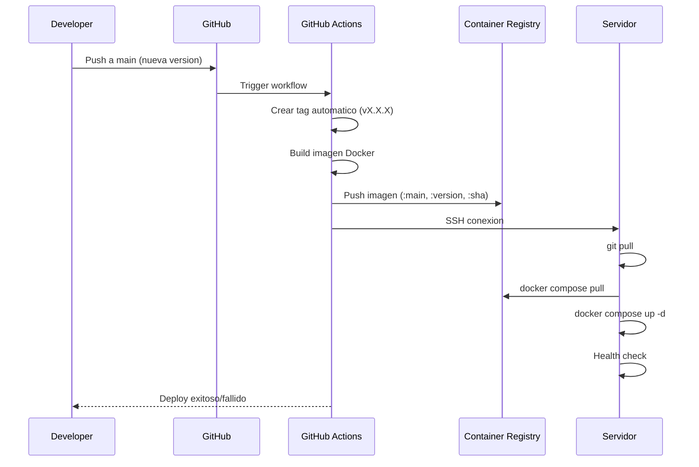
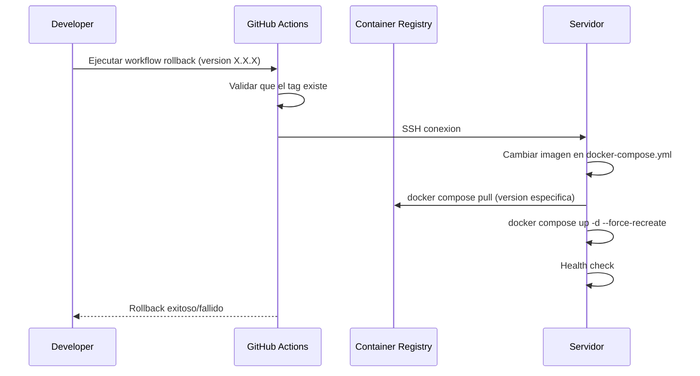
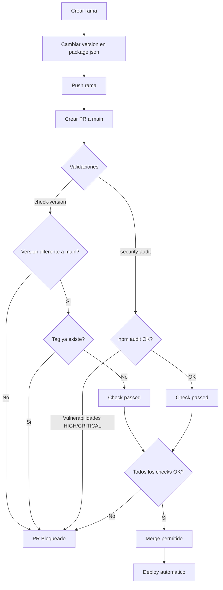
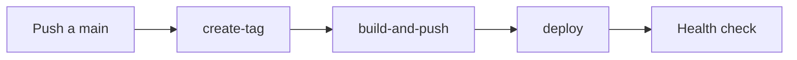

# Test Deploy

Proyecto Node.js dockerizado con CI/CD automatizado usando GitHub Actions.

## Arquitectura



## Flujo de Deploy



## Flujo de Rollback



## Flujo de Pull Request



## Estructura del Proyecto

```
test-deploy/
├── .github/
│   └── workflows/
│       ├── deploy.yml          # Deploy automatico
│       ├── rollback.yml        # Rollback manual
│       └── validate-version.yml # Validacion en PRs
├── .dockerignore
├── Dockerfile
├── docker-compose.yml
├── index.js                    # Servidor Express
├── package.json
└── README.md
```

## Endpoints

| Endpoint | Metodo | Descripcion |
|----------|--------|-------------|
| `/` | GET | Mensaje de bienvenida con timestamp |
| `/health` | GET | Health check con version de la app |

## Workflows

### Deploy (deploy.yml)

Se ejecuta en push a main:

1. **create-tag**: Crea tag automatico basado en `package.json`
2. **build-and-push**: Construye y sube imagen a ghcr.io
3. **deploy**: Despliega en el servidor via SSH



### Rollback (rollback.yml)

Se ejecuta manualmente desde GitHub Actions:

1. Seleccionar version a desplegar
2. Valida que el tag exista
3. Cambia imagen en el servidor
4. Verifica health check

### Validate Version (validate-version.yml)

Se ejecuta en PRs a main:

1. **check-version**: Valida que la version sea diferente y el tag no exista
2. **security-audit**: Ejecuta `npm audit`

## Imagenes Docker

Cada build crea tres tags en ghcr.io:

| Tag | Descripcion |
|-----|-------------|
| `:main` | Ultima version de main |
| `:X.X.X` | Version especifica (para rollback) |
| `:<sha>` | Commit especifico |

## Seguridad

- **npm audit**: Escaneo de vulnerabilidades en dependencias
- **Trivy**: Escaneo de vulnerabilidades en imagen Docker
- **Docker no-root**: Contenedor ejecuta como usuario `nodejs`
- **Versiones fijadas**: GitHub Actions usan versiones especificas

## Como usar

### Deploy nueva version

```bash
# 1. Actualizar version en package.json
# 2. Commit y push
git add -A
git commit -m "Bump version to X.X.X"
git push origin main
```

### Rollback

1. Ir a [Actions > Rollback](../../actions/workflows/rollback.yml)
2. Click "Run workflow"
3. Ingresar version (ej: `1.0.8`)
4. Click "Run workflow"

### Ver versiones disponibles

- [GitHub Packages](../../pkgs/container/test-deploy)

## Configuracion

### Secrets requeridos

| Secret | Descripcion |
|--------|-------------|
| `SERVER_HOST` | IP o dominio del servidor |
| `SERVER_USER` | Usuario SSH |
| `SSH_PRIVATE_KEY` | Llave privada SSH |

### Proteccion de rama

Configurar en Settings > Branches > main:

- Require pull request before merging
- Require status checks: `check-version`, `security-audit`
- Do not allow bypassing the above settings

## Tecnologias

- **Runtime**: Node.js 20 Alpine
- **Framework**: Express
- **Contenedor**: Docker + Docker Compose
- **Proxy**: Traefik v3
- **CI/CD**: GitHub Actions
- **Registry**: GitHub Container Registry (ghcr.io)
